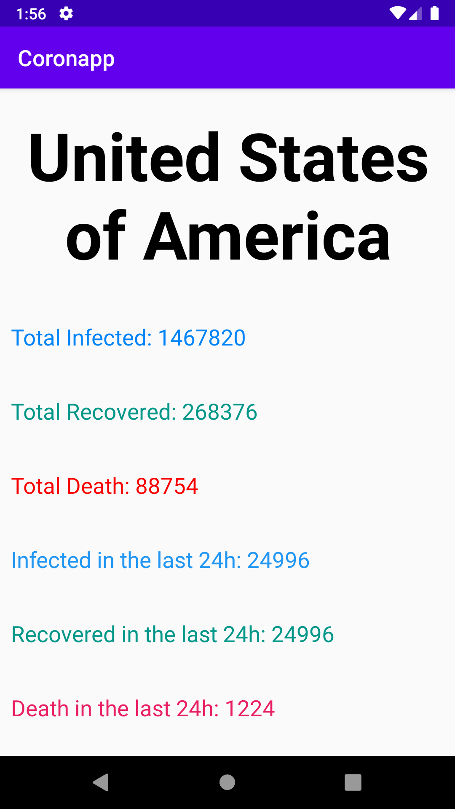

# Coronapp

## Présentation

Projet d'une application mobile dans le cadre du cours Programmation Mobile ESIEA

Cette application affiche les pays toucher par le corona virus et utilise l'API de Github permettant d'aller chercher un fichier sur le repo d'un utilisateur Github.

## Prérequis


- Installation d'Android Studio
- Récupérer la branche Master<br/>


````
https://github.com/braseo/Coronapp.git
````

## Consignes respectées : 


- Écrans : 2 activités, 2 fragments
- Affichage d'une liste d’éléments dans une Recycler View
- Affichage du détail d'un item de la liste dans une autre activité
- Appel WebService à une API Rest
- Stockage de données en cache

- Fonctions supplémentaires :
	- Barre de recherche
	- Redirection sur les détails des pays (morts, survivants)
	- Menu avec des options cliquables, bouton paramètre et bouton exit (ferme l'application) 
	- Clean architecture & MVC
	- Singletons pour les objets
	- Gitflow


## Fonctionnalités: 

### Premier écran 

- Recycler view avec le nom des pays toucber par le coronavirus .


- Menu en appuyant sur les 3 points en haut à droite avec 2 options:
	
	- Settings qui affiche un toast
	- Exit qui quitte l'application

	
- Barre de recherche pour trouver directement un pays


### Ecran détail des pays, le nombre de contaminé et le nombre de mort

- Affiche le pays
- Affiche le nombre de contaminé 
- Affiche le nombre de personnes qui ont survécu au virus




### Notifications

Reception de notification avec Firebase Cloud Messaging.


