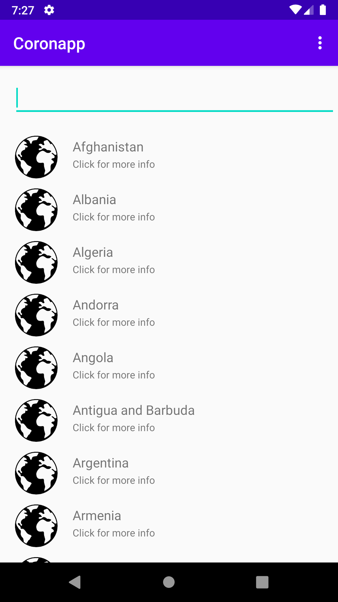
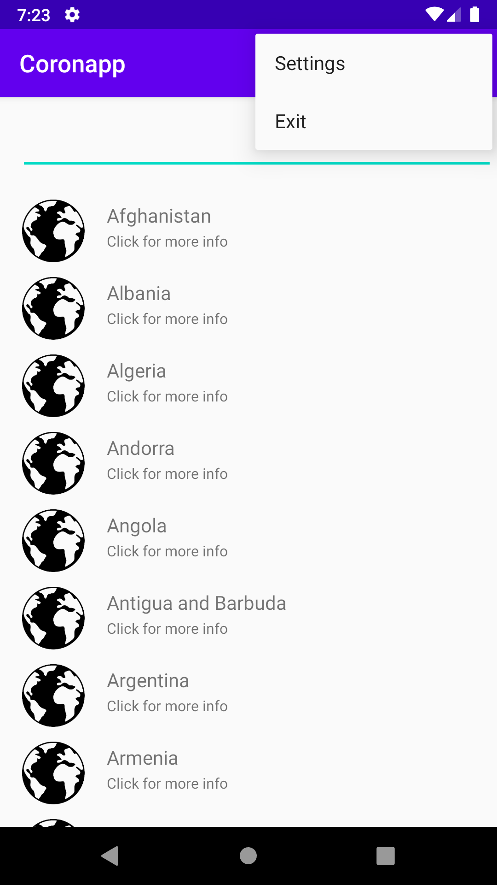
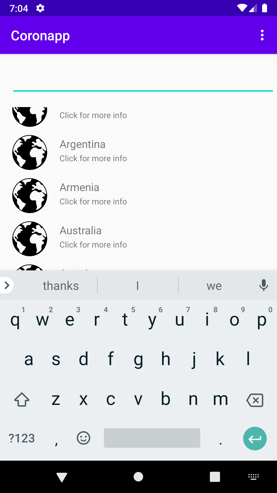
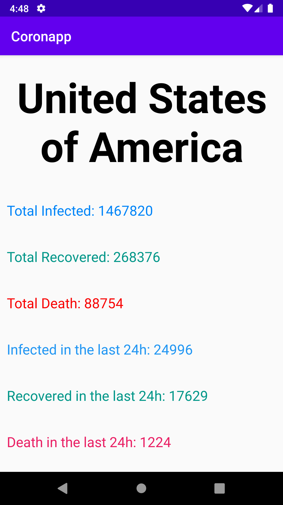
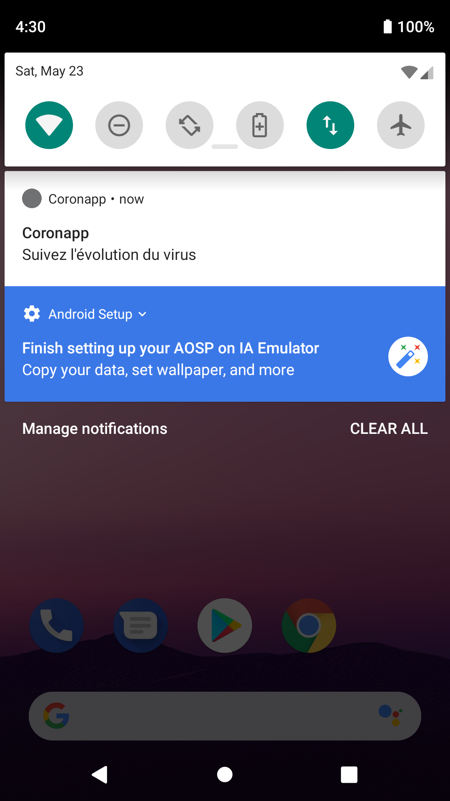

# Coronapp

## Présentation

Projet d'une application mobile dans le cadre du cours Programmation Mobile ESIEA

Coronapp est une application Android qui permet de voir le nombre de personnes contaminé, guéri et morte du coronavirus en fonction du pays.

## Prérequis


- Installation d'Android Studio
- Récupérer la branche Master<br/>


````
https://github.com/braseo/Coronapp.git
````

## Consignes respectées : 


- Écrans : 2 activités, 2 fragments
- Affichage d'une liste d’éléments dans une Recycler View
- Affichage du détail d'un item de la liste dans une autre activité
- Appel WebService à une API Rest
- Stockage de données en cache

- Fonctions supplémentaires :
	- Barre de recherche
	- Redirection sur les détails des pays (morts, survivants)
	- Menu avec des options cliquables, bouton paramètre et bouton exit (ferme l'application) 
	- Clean architecture & MVC
	- Singletons pour les objets
	- Gitflow


## Fonctionnalités: 

### Premier écran 

- Recycler view avec les noms des pays touchés par le coronavirus.



- Menu en appuyant sur les 3 points en haut à droite avec 2 options:
	
	- Settings qui affiche un toast
	- Exit permet de quitter l'application
	

	
- Barre de recherche pour trouver directement un pays



### Ecran détail des pays avec le nombre de contaminé, le nombre de personnes qui ont guéri du virus et le nombre de mort

- Affiche le pays
- Affiche le nombre de contaminé 
- Affiche le nombre de personnes qui ont guéri du virus
- Affiche le nombre de mort
- Affiche le nombre de contaminé dans les dernières 24h
- Affiche le nombre de personnes qui ont guéri du virus dans les dernières 24h
- Affiche le nombre de mort dans les dernières 24h



### Notifications

Reception de notification avec Firebase Cloud Messaging.



## Usage

API: [covid19](https://covid19api.com/)
